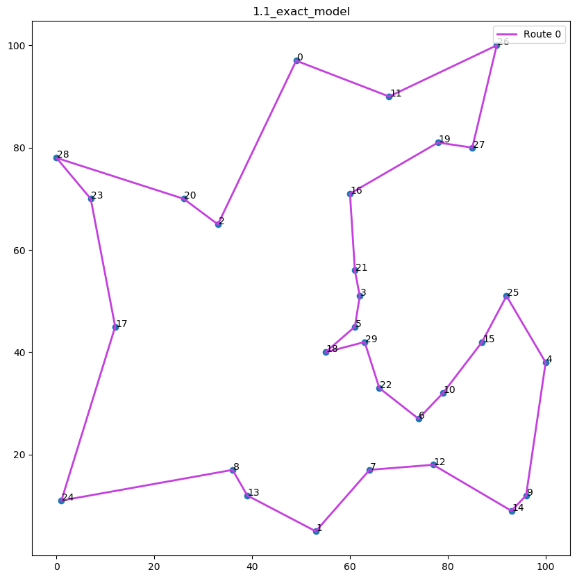

# TSP Optimization

## 1.1 Exact model 1

##### 1.1a

Obj: 496

##### 1.1b

##### 1.1c

LPrelax: 440.38333850706675

Optimality gap: 11.21%

## 1.2 Exact model 2

##### 1.2a

Obj: 206.0

x[i,j] variables:

-   x[0,2]
-   x[1,6]
-   x[2,0]
-   x[3,5]
-   x[4,1]
-   x[5,3]
-   x[6,4]

u[i] variables:

-   u[0] = 1
-   u[1] = 1
-   u[2] = 1
-   u[3] = 1
-   u[4] = 1
-   u[5] = 1
-   u[6] = 1

Tour(s)

-   [0, 2, 0]
-   [1, 6, 4, 1]
-   [3, 5, 3]

**Notice**

-   Solution has subtours, due to not using constraint (9)
-   All u[i] variables are equal to 1. Without constraint (9), the u[i] variables are only required to be between 1 and n (inclusive), and u[0] must equal 1. There is no constraint that makes u[i] = u[j] with i != j illegal.

#### 1.2b

Obj: 257.0

x[i,j] variables:

-   x[0,2]
-   x[1,6]
-   x[2,1]
-   x[3,0]
-   x[4,5]
-   x[5,3]
-   x[6,4]

u[i] variables:

-   u[0] = 1
-   u[1] = 3
-   u[2] = 2
-   u[3] = 7
-   u[4] = 5
-   u[5] = 6
-   u[6] = 4

Tour(s)

-   [0, 2, 1, 6, 4, 5, 3, 0]

**Notice**

-   Solution has no subtours as we are now using constraint (9).
-   Objective value has increased from 206 to 257, this is because the constraint of subtours is more strict and disallows any tour that has subtours.
-   All u[i] variables are now unique and correctly indicate their position in the tour. If x[i,j] = 1, this means that we travel from node i to node j. Thus, node j comes directly after node i, resulting in u[j] = u[i] + 1

#### 1.2c

#### 1.2d

## 1.3 Nearest Neighbor Heuristic

## 1.4 Late Acceptance Heuristic

## 2 ProLogistics
