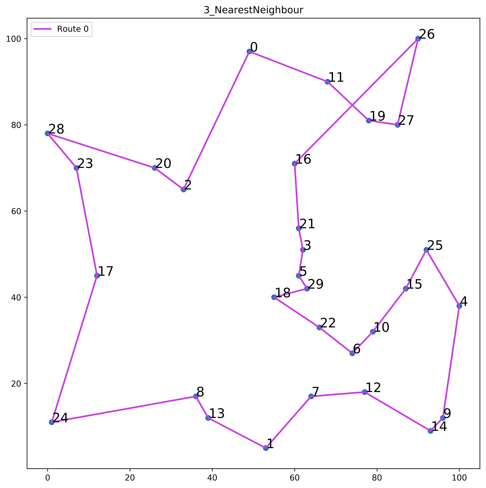

# TSP Optimization

# 1.1 Exact model 1

#### (a)

Obj: 496

#### (b)

#### (c)

LPrelax: 440.38333850706675

Optimality gap: 11.21%

# 1.2 Exact model 2

### (a)

Obj: 206.0

x[i,j] = 1 variables:

| i   | j   | dij | ui  |
| --- | --- | --- | --- |
| 0   | 2   | 36  | 1.0 |
| 1   | 6   | 32  | 1.0 |
| 2   | 0   | 36  | 1.0 |
| 3   | 5   | 7   | 1.0 |
| 4   | 1   | 58  | 1.0 |
| 5   | 3   | 7   | 1.0 |
| 6   | 4   | 30  | 1.0 |

Tour(s)

-   [0, 2, 0]
-   [1, 6, 4, 1]
-   [3, 5, 3]

**Notice**

-   Solution has subtours, due to not using constraint (9)
-   All u[i] variables are equal to 1. Without constraint (9), the u[i] variables are only required to be between 1 and n (inclusive), and u[0] must equal 1. There is no constraint that makes u[i] = u[j] with i != j illegal.

### (b)

Obj: 257.0

x[i,j] = 1 variables:

| i   | j   | dij | ui  |
| --- | --- | --- | --- |
| 0   | 2   | 36  | 1.0 |
| 1   | 6   | 32  | 3.0 |
| 2   | 1   | 64  | 2.0 |
| 3   | 0   | 48  | 7.0 |
| 4   | 5   | 40  | 5.0 |
| 5   | 3   | 7   | 6.0 |
| 6   | 4   | 30  | 4.0 |

Tour(s)

-   [0, 2, 1, 6, 4, 5, 3, 0]

**Notice**

-   Solution has no subtours as we are now using constraint (9).
-   Objective value has increased from 206 to 257, this is because the constraint of subtours is more strict and disallows any tour that has subtours.
-   All u[i] variables are now unique and correctly indicate their position in the tour. If x[i,j] = 1, this means that we travel from node i to node j. Thus, node j comes directly after node i, resulting in u[j] = u[i] + 1

### (c)

Obj: 496

Tour: [0, 11, 26, 27, 19, 16, 21, 3, 5, 18, 29, 22, 6, 10, 15, 25, 4, 9, 14, 12, 7, 1, 13, 8, 24, 17, 23, 28, 20, 2, 0]

### (d)

-   LPrelax: 417.41
-   Optimality gap: 15.84%

# 1.3 Nearest Neighbor Heuristic

### (a)

Obj: 507

x[i,j] = 1 variables:

Tour
[0, 11, 19, 27, 26, 16, 21, 3, 5, 29, 18, 22, 6, 10, 15, 25, 4, 9, 14, 12, 7, 1, 13, 8, 24, 17, 23, 28, 20, 2, 0]

### (b)

**Looks similar to optimal solution, and Obj (507) is close to optimal (496)**

### (c)

Optimality gap: 2.17%

-   The LP Relaxation is less strict and its ObjVal is lower than with integer constraints, as there is more 'state-space' now; Xij can take any value between [0,1].

-   If the heuristic is optimal in this instance, then its solution will be equal to the non Relaxation optimal solution
-   Else, if the heuristic is suboptimal (usually the case), solution will be higher than optimal solution, for a minimization problem.

-   Since the non LP Relaxation ObjVal is always equal to or larger than the LP Relaxation Objval, it follows that the Heuristic Objval  is always equal to or larger than the LP Relaxation Objval

-   Thus, for minimization, given LP of **L**, Relaxation LP of **R**, Heuristic of **H** for a problem, the following holds:
    **H.ObjVal >= L.ObjVal >= R.ObjVal**

### (d)

| Starting Point | ObjVal |
| -------------- | ------ |
| 2              | 569    |
| 16             | 507    |
| 17             | 616    |

## 1.4 Late Acceptance Heuristic

### (a)

Obj: 556

x[i,j] = 1 variables:

| i   | j   | dij |
| --- | --- | --- |
| 0   | 4   | 78  |
| 4   | 9   | 27  |
| 9   | 14  | 5   |
| 14  | 12  | 19  |
| 12  | 7   | 14  |
| 7   | 1   | 17  |
| 1   | 13  | 16  |
| 13  | 8   | 6   |
| 8   | 24  | 36  |
| 24  | 17  | 36  |
| 17  | 23  | 26  |
| 23  | 28  | 11  |
| 28  | 20  | 28  |
| 20  | 2   | 9   |
| 2   | 16  | 28  |
| 16  | 21  | 16  |
| 21  | 3   | 6   |
| 3   | 5   | 7   |
| 5   | 18  | 8   |
| 18  | 22  | 14  |
| 22  | 10  | 14  |
| 10  | 6   | 8   |
| 6   | 15  | 20  |
| 15  | 25  | 11  |
| 25  | 27  | 30  |
| 27  | 19  | 8   |
| 19  | 26  | 23  |
| 26  | 11  | 25  |
| 11  | 0   | 21  |

Tour
[0, 4, 9, 14, 12, 7, 1, 13, 8, 24, 17, 23, 28, 20, 2, 16, 21, 3, 5, 18, 22, 6, 10, 15, 25, 27, 19, 26, 11, 0]

Optimality gap: 10.79%

### (b)

-   1083
-   1169
-   1174
-   1245
-   1356
-   1086
-   1295
-   1060
-   1199
-   1121

### (c)

| L   | ObjVal1 | ObjVal2 | ObjVal3 | ObjVal4 | ObjVal5 | ObjVal6 | ObjVal7 | ObjVal8 | ObjVal9 | ObjVal10 |
| --- | ------- | ------- | ------- | ------- | ------- | ------- | ------- | ------- | ------- | -------- |
| 1   | 1298    | 1242    | 1277    | 1258    | 1288    | 1173    | 1181    | 1002    | 1365    | 1356     |
| 10  | 1151    | 1221    | 1218    | 1204    | 1115    | 1200    | 1058    | 1165    | 1148    | 1204     |
| 20  | 1107    | 1083    | 1100    | 1133    | 1164    | 1149    | 975     | 1199    | 1132    | 1048     |
| 50  | 1191    | 1095    | 936     | 1130    | 1091    | 1134    | 1105    | 1087    | 1319    | 1101     |
| 100 | 1099    | 964     | 1061    | 1149    | 1058    | 1067    | 1050    | 1099    | 1062    | 1061     |
| 150 | 1043    | 1052    | 1023    | 1084    | 1036    | 945     | 1025    | 972     | 1040    | 1059     |

### (d)

LPrelax: 666.65

Optimality gap: 28.78%

### (e)

Use

## 2 ProLogistics
